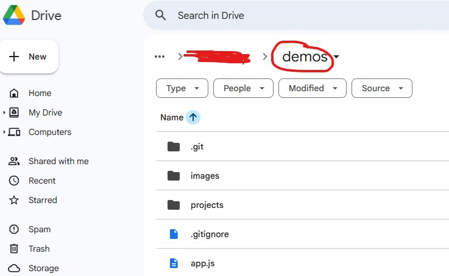
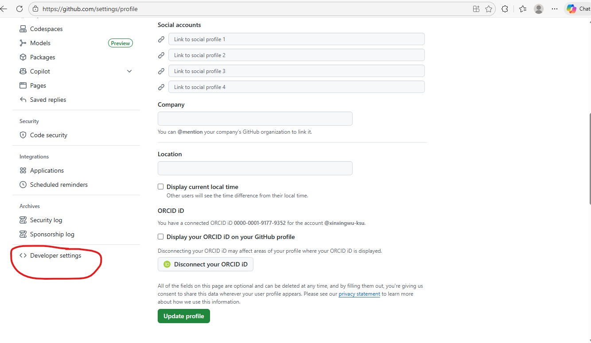
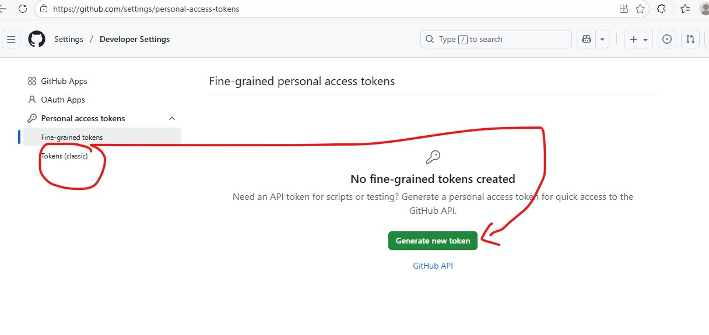
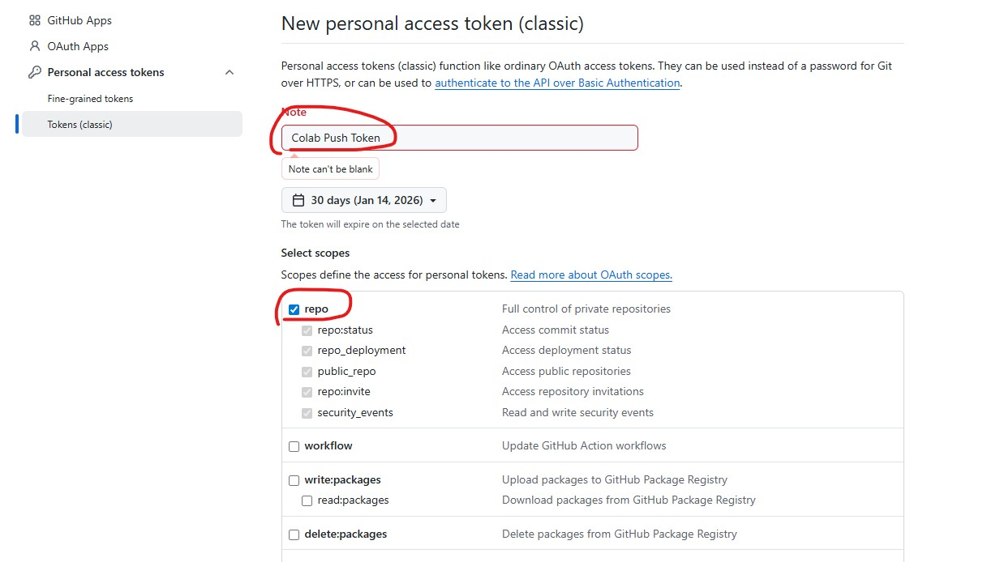
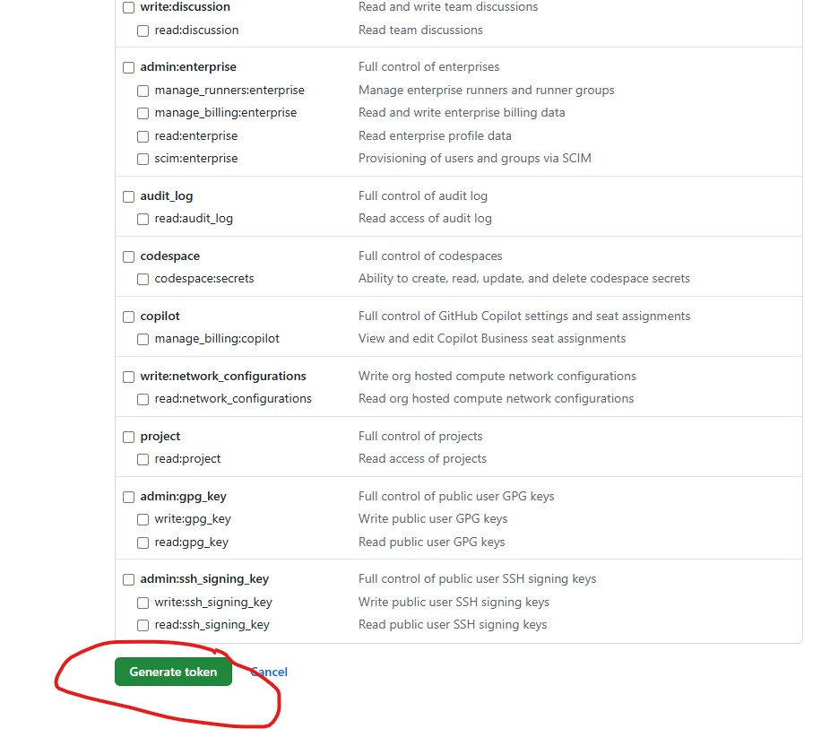

# Push-Google-Drive-to-GitHub

## Assume:

- Repo: https://github.com/xinxingwu-ksu/xinxingwu-ksu.github.io

- You are running this in Google Colab

- Your project folder is already inside Google Drive

# Use Google Colab to push Drive → GitHub 

Step-by-step in Colab (Replace YOUR_GITHUB_TOKEN with your GitHub Personal Access Token)

---
---

# What is `YOUR_GITHUB_TOKEN`?

`YOUR_GITHUB_TOKEN` is **not** something Google Colab creates.

It refers to a **GitHub Personal Access Token (PAT)** that **you generate in your GitHub account**. GitHub no longer allows password-based authentication for `git push`, and Colab can’t reliably prompt for a username/password, so a token is commonly used instead.

---

## Why you need it (especially in Colab)

When you run Git commands like:

- `git push`
- `git clone` (private repos)
- `git pull` (private repos)

GitHub needs authentication. In Colab, using a PAT is the simplest way to authenticate.

---

## Step-by-step: How to create `YOUR_GITHUB_TOKEN`

### 1️⃣ Open GitHub Token Page
While logged into GitHub, go to:

https://github.com/settings/tokens

### 2️⃣ Click “Generate new token”

Choose:

- **Classic token** *(simpler, recommended)*

### 3️⃣ Configure the token
Fill in:

- **Note:** `Colab Push Token`

- **Expiration:** `7 days` or `30 days` *(recommended)*
- **Scopes (IMPORTANT):**
  - ✅ `repo`

